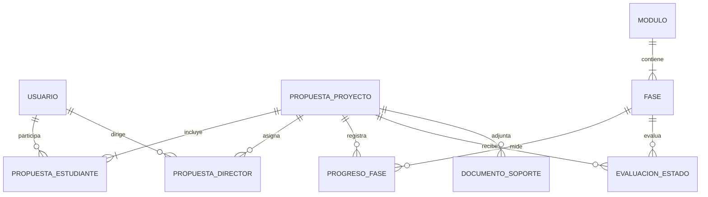

# Modelo de dominio

- `Usuario`: UUID, nombre, correo, tipo, estado y fechas UTC.
- `PropuestaProyecto`: UUID, título y descripción iniciales, estado y fechas UTC.
- `PropuestaEstudiante`: relación N:M entre propuestas y estudiantes.
- `PropuestaDirector`: historial de asignaciones; máximo un registro ACTIVO por propuesta.
- `Modulo` 1:N `Fase`: catálogos ordenados y desactivables.
- `ProgresoFase`: único por propuesta y fase.
- `Agente`: catálogo independiente; no ejecuta IA todavía.
- `EvaluacionEstado`: historial N por propuesta y fase.
- `DocumentoSoporte`: metadatos; `ruta` es temporal y no representa un objeto S3.

Los UUID nuevos se generan en el servicio. Fechas se guardan como ISO 8601 UTC.
